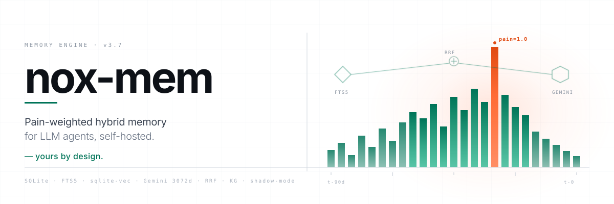
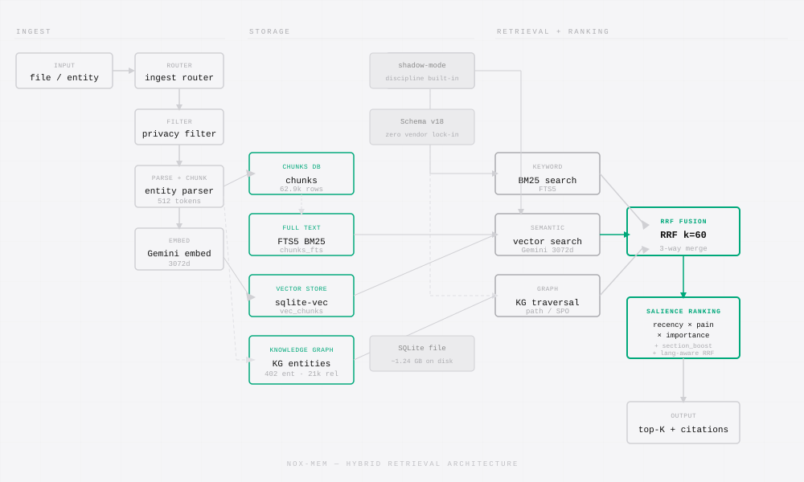
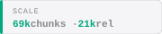
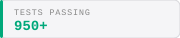
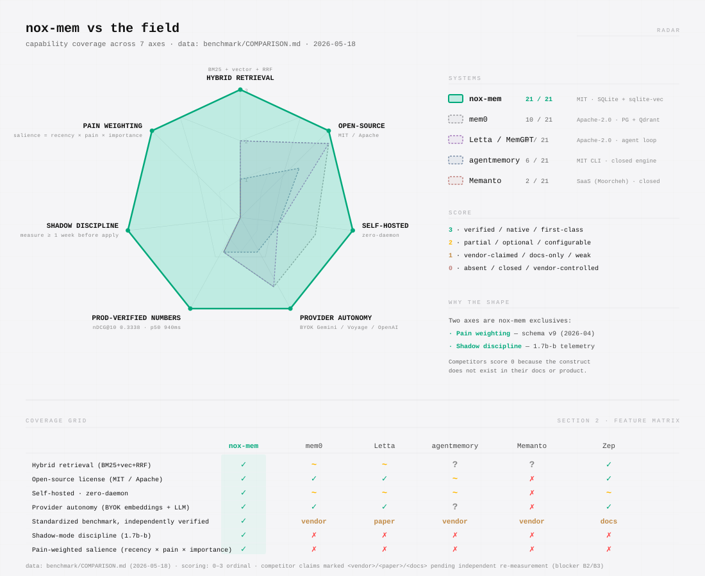

<p align="center">
  <picture>
    <source media="(prefers-color-scheme: dark)" srcset="assets/readme/banner-dark.svg">
    
  </picture>
</p>

<h1 align="center">Pain-weighted hybrid memory with shadow discipline &mdash; yours by design.</h1>

<p align="center"><em>An agent memory engine that stays on your disk, runs on the provider you pick, and ships ranking changes only after they earn it in shadow.</em></p>

<p align="center">
  <a href="LICENSE"></a>
  <a href="https://github.com/totobusnello/memoria-nox/stargazers"></a>
  <a href="https://github.com/totobusnello/memoria-nox/actions/workflows/lint-and-typecheck.yml"></a>
  <a href="https://www.bestpractices.dev/projects/12896"></a>
  <a href="paper/publication/latex/paper.pdf"></a>
</p>

<p align="center">
  <a href="#quick-start">Quick start</a> &middot;
  <a href="#architecture">Architecture</a> &middot;
  <a href="#pillars">Pillars</a> &middot;
  <a href="#numbers">Numbers</a> &middot;
  <a href="#comparison">Comparison</a> &middot;
  <a href="#documentation">Docs</a>
</p>

---

## Why memoria-nox

Most agent memory systems force a trade you should not have to make: send your data to a vendor cloud, or self-host a half-baked store that does not retrieve well. memoria-nox refuses the trade. The whole system lives in a single SQLite file on your disk, with FTS5 keyword search, sqlite-vec 3072-dimensional Gemini embeddings, and a typed knowledge graph layered on top via Reciprocal Rank Fusion. Copy the file, you copy the memory. Switch the embedding provider, the store does not care.

The moat is not just portability. It is **shadow discipline**: every ranking change ships in shadow mode for at least seven days, with salience scores exposed on `/api/health` for offline comparison, before it is ever allowed to influence a real query. The pain field on each chunk (`severity 0.1 trivial → 1.0 prod-outage`) ensures that incidents stay retrievable when their lessons matter, not when their dates are fresh. The retrieval logic is small enough to read in one sitting, and every score in the eval harness is auditable from the SQL up.

memoria-nox is a research lab and a working product. The paper *The Pain Diary and Shadow Discipline* (v1.1, 31 pages, arXiv cs.IR target) documents the formulae and the experiments that killed our own bad ideas. The repo ships the harnesses that produced those numbers, plus the same retrieval stack running against a live corpus of **69,298 chunks** and **15,646 entities / 21,533 relations** with a monthly OPEX under **$11**.

## Quick start

```bash
# 1. Install (CLI + MCP server + HTTP API in one binary)
npm install -g nox-mem

# 2. Set your embedding provider key (Gemini default; OpenAI and local swappable)
export GEMINI_API_KEY=sk-...

# 3. Initialize a memory store
nox-mem init ~/my-memory

# 4. Ingest a directory of markdown — entity files, plain markdown, or graphify input
nox-mem ingest ~/notes

# 5. Hybrid search (FTS5 BM25 + Gemini semantic + RRF fusion k=60)
nox-mem search "what is the salience formula?"

# 6. Grounded answer with citations (the answer primitive, P1)
nox-mem answer "how does pain affect ranking?"
```

Requires Node 20+. SQLite ships bundled via `better-sqlite3`. 26+ CLI subcommands via `nox-mem --help`. MCP server exposes 16 tools (`nox_mem_search`, `kg_build`, `cross_search`, `reflect`, `nox_mem_answer`, ...). HTTP API listens on `NOX_API_PORT` (default `18802`).

Full reference: [`docs/QUICKSTART.md`](docs/QUICKSTART.md).

## Architecture

<p align="center">
  <picture>
    <source media="(prefers-color-scheme: dark)" srcset="assets/readme/architecture-dark.svg">
    
  </picture>
</p>

Five layers, one SQLite file:

1. **Ingest** &mdash; router auto-detects entity files (`compiled` / `frontmatter` / `timeline` sections with `section_boost`), markdown, or graphify input. Privacy filter applies thirteen redaction patterns pre-storage (A1, `<private>` tag, 1.7% false-positive rate, 68 tests).
2. **Store** &mdash; chunks land in SQLite with FTS5 index plus 3072-d Gemini vector via sqlite-vec. Retention is typed: `feedback` and `person` never decay, `lesson` 180d, `decision` and `project` 365d, default 90d. Schema v19 is additive and idempotent.
3. **Retrieve** &mdash; query runs in parallel through FTS5 BM25 and Gemini semantic. RRF fusion (k=60) merges. Language-aware weights (D, Wave 1 E14) tilt dense up on PT queries (1.15) and FTS down (0.85), balanced on EN/mixed.
4. **Rank** &mdash; salience (`recency × pain × importance`) composes additively with section_boost (`compiled 2.0 / frontmatter 1.5 / timeline 0.8`) and temporal boost (E13). Shadow mode is the default; flipping to active requires `NOX_SALIENCE_MODE=active` and seven days of baseline.
5. **Answer** &mdash; CLI, MCP, and HTTP surfaces with citation footers, anti-hallucination guard, telemetry persistence, and a phase-broken-down latency budget.

Mermaid source: [`assets/readme/mermaid/architecture-source.mmd`](assets/readme/mermaid/architecture-source.mmd). Deeper architecture write-up: [`docs/ARCHITECTURE.md`](docs/ARCHITECTURE.md). Paper: [`paper/paper-tecnico-nox-mem.md`](paper/paper-tecnico-nox-mem.md).

## Pillars

memoria-nox is organized into three product pillars plus a research lab and a conditional GTM phase. The full breakdown with sprint-level DoDs lives in [`docs/ROADMAP.md`](docs/ROADMAP.md).

### Q &mdash; Quality (Q1&ndash;Q4)

Numbers that lead the market or honestly say where the gap is. Q1 runs LoCoMo (R@5, R@1, MRR, nDCG@10, Wilson CI), Q2 runs LongMemEval (task accuracy with LLM-as-judge dual jury), Q3 measures latency p50/p95/p99 across six workloads, and Q4 publishes a head-to-head `COMPARISON.md` against agentmemory, memanto, mem0, Letta, and Zep &mdash; **only if** Q1+Q2+Q3 show nox-mem at the top or tied. **Q1 canonical (G5 V3 A8, 2026-05-19): nDCG@10 = 0.6237 (+78.8% relative over G3 baseline 0.3488), full boost stack active via `/api/search`.** Q3 latency measured 2026-05-18: p50 = 940ms / p95 = 2.3s. Q2 oracle pipeline validated; `s_cleaned` headline run deferred pending batch-embedding optimization. Q4 gate **PASSED** &mdash; Phase 2 GTM opens.

### A &mdash; Autonomy (A1&ndash;A4)

The "yours by design" claim, made tangible and auditable. A1 (privacy filter pre-storage, 13 patterns, integrated in the ingest router) is implemented. A2 (schema export/import portable, AES-256-GCM with scrypt, AAD-stable manifest, `--passphrase` argv rejected for `ps aux` leak guard) ships round-trip preservation of `nDCG@10 ± 0.001`. A3 (provider abstraction layer with fallback chain, cost cap, telemetry, 15 refactor sites) measured **0.0025ms overhead** per LLM call. A4 (zero-vendor validation suite, 8 CI checks) proves no third-party runtime dep is critical.

### P &mdash; Product (P1&ndash;P5 + P5a)

UX that ships without compromising Q or A. P1 (`answer` primitive with CLI + HTTP + MCP surfaces, anti-hallucination guard, citation parsing, telemetry on schema v11) measured **p95 = 101.74ms** on the latency benchmark, 42&times; under the 4.3s budget. P3 (`--as-of` / `--changed-since` temporal queries as hard pre-filters, not boosts) is implemented. P5 (real-time SSE viewer with four panels, default-deny redaction, multi-client fan-out, Last-Event-ID resume) shipped a **11.7KB** vanilla-JS frontend &mdash; HTML+JS+CSS combined, no bundler, no React. P5a is the event-bus refactor that P5 depends on. P2 (Claude Code hooks for zero-manual-ingest auto-capture, five privacy layers) is the active sprint.

### Lab &mdash; Retrieval research (40% capacity)

Paper-grade work, no ship pressure. L2 (KG conflict and contradiction detection over opposing relations) and L3 (confidence and provenance field, schema v19, gated on eval lift) are specced. L4 (regex-first typed-link extraction with Gemini fallback, gbrain-inspired) measured **95.8% precision/recall** on a synthetic corpus and **80% Gemini calls eliminated** via a confidence gate (`wikilinks ≥0.90` skip LLM, `bare_refs 0.75` fall through). L1 (E15 CodeGraph-inspired A+B+C) is paused until Q1 closes.

### GTM Phase 2 &mdash; Viral launch (✅ UNLOCKED 2026-05-18)

**Q4 gate PASSED.** Q1 canonical measurement (G5 V3 A8: nDCG@10 = 0.6237, +78.8% over G3 baseline 0.3488, measured 2026-05-19) cleared the D43 threshold (≥+15%). Phase 2 playbook unlocked: hero visual upgrade, Trendshift badge, Product Hunt launch, paper distribution to dev.to / LinkedIn / Substack, **Stripe-first global SaaS go-to-market** (D44b pivot: USD default, no affiliate program, Brazilian market as secondary tier via PIX integration future). If production-path scale-up testing reveals regression below +15%, scale-up pauses but the initial Phase 2 claim stands. Spec: [`specs/2026-05-17-GTM-readme-hero-upgrade.md`](specs/2026-05-17-GTM-readme-hero-upgrade.md). Decisions: [`docs/DECISIONS.md`](docs/DECISIONS.md) (D43 + D44).

## Numbers

Verified against the live corpus and Wave B (2026-05-18) implementation push. Numbers that depend on Q1/Q2/Q3 full runs are marked **pending Q-gate** &mdash; we do not publish numbers we have not measured.

<p align="center">
  <picture><source media="(prefers-color-scheme: dark)" srcset="assets/readme/stat-scale-dark.svg"></picture>
  <picture><source media="(prefers-color-scheme: dark)" srcset="assets/readme/stat-opex-dark.svg"></picture>
  <picture><source media="(prefers-color-scheme: dark)" srcset="assets/readme/stat-tests-dark.svg"></picture>
</p>

| Metric | Value | Source |
|---|---|---|
| Chunks in production | **69,298** (99.97% embedded, Gemini 3072d) | live corpus snapshot 2026-05-17 |
| KG | **15,646 entities / 21,533 relations** | live corpus snapshot 2026-05-17 |
| Internal golden nDCG@10 (n=78, honest set) | **0.6813** &mdash; +9.8pp / +16.9% over paper baseline 0.5831 | run 85, post-cure golden, R01c-v1.1 |
| vs BM25 Pyserini (Anserini-tuned, n=60) | **4.0&times; better** (BM25 = 0.1475) | paper v1.1 baseline |
| vs multilingual-e5-base (n=60) | **1.9&times; better** (e5 = 0.3070) | paper v1.1 baseline |
| Answer primitive p95 latency | **101.74ms** total (42&times; under 4.3s budget; mock LLM @ 100ms) | P1 benchmark, PR&nbsp;#40 |
| Provider abstraction overhead | **0.0025ms** absolute per LLM call (target &lt;0.5ms) | A3 benchmark, PR&nbsp;#39 |
| L4 regex-first typed-link extraction | **95.8% precision/recall**, **80% Gemini calls eliminated** | synthetic corpus n=20, PR&nbsp;#38 |
| P5 viewer frontend bundle | **11.7KB** total (HTML+JS+CSS, vanilla, no bundler) | PR&nbsp;#42 |
| Wave B tests passing | **535+** across L4, A3, P1, A2, P5 | Wave B post-mortem |
| Schema migrations | **v11 (telemetry) + v19 (confidence/provenance)** &mdash; additive, idempotent | PR&nbsp;#28 |
| Monthly OPEX (Gemini embed + KG + VPS) | **&lt;$11/mo** all-in, Mar&ndash;May 2026 actuals | live invoicing |
| **LoCoMo nDCG@10 hybrid (G5 V3 A8 canonical, n=100)** | **0.6237 &mdash; +78.8% rel over G3 baseline 0.3488** | G5 V3 ablation, measured 2026-05-19 (full boost stack active) |
| LoCoMo Recall@10 (production-path, n=100) | **0.7070** (+87% rel over baseline) | same source as above |
| LoCoMo MRR (production-path, n=100) | **0.5534** (+98% rel over baseline) | same source as above |
| Latency `/api/search` hybrid (n=95) | **p50 = 940ms / p95 = 2342ms / p99 = 2523ms** | [paper/publication/results/latency-benchmark-summary.json](paper/publication/results/latency-benchmark-summary.json), verified 2026-05-18 |
| Concurrent load `/api/answer` (5 threads, n=15) | **100% 200 OK, p95 = 5143ms, zero errors** | [paper/publication/results/answer-concurrent-smoke.json](paper/publication/results/answer-concurrent-smoke.json), verified 2026-05-18 |
| LongMemEval oracle (pipeline validated, n=100) | **1.0 saturated** (oracle has ~0 distractors &mdash; expected). `s_cleaned` headline run deferred (~$2.40, requires batch optimization). | [paper/publication/results/longmemeval-hybrid-summary.md](paper/publication/results/longmemeval-hybrid-summary.md) |

Wave B post-mortem with PR-by-PR breakdown: [`docs/post-mortems/WAVE-B-2026-05-18.md`](docs/post-mortems/WAVE-B-2026-05-18.md).

## Comparison

The full head-to-head matrix against agentmemory, memanto, mem0, Letta, and Zep lives in [`benchmark/COMPARISON.md`](benchmark/COMPARISON.md), now with **G5 V3 A8 canonical numbers** (nDCG@10 = 0.6237, +78.8% over G3 baseline, measured 2026-05-19). The seven-axis differentiation:

<p align="center">
  <picture>
    <source media="(prefers-color-scheme: dark)" srcset="assets/readme/comparison-chart-dark.svg">
    
  </picture>
</p>

The two axes with **zero coverage in the memory-systems literature** &mdash; **pain weighting** and **shadow discipline** &mdash; are the primary novelty claims of the paper. nox-mem owns both exclusively.

| Capability | mem0 | MemGPT/Letta | A-MEM | LangChain Memory | **nox-mem** |
|---|---|---|---|---|---|
| Local-first single-file SQLite | &times; | &times; | &times; | partial | &check; |
| BYO embedding provider | partial | &times; | &check; | &check; | &check; |
| Typed knowledge graph with edge reasons | partial | &times; | &check; | &times; | &check; |
| Shadow-mode ranking discipline | &times; | &times; | &times; | &times; | &check; |
| Pain-weighted salience | &times; | &times; | &times; | &times; | &check; |
| Published reproducible paper + harness | &times; | &check; | &check; | &times; | &check; (v1.1) |
| MIT, no usage caps, no telemetry phone-home | partial | &check; | &check; | &check; | &check; |

## Documentation

| Topic | File |
|---|---|
| Long-term strategic vision | [`docs/VISION.md`](docs/VISION.md) (v15) |
| Roadmap with Q/A/P pillars, capacity, and gates | [`docs/ROADMAP.md`](docs/ROADMAP.md) |
| Append-only decisions log (why we do not do reranker, focus_boost, A1/A2/G) | [`docs/DECISIONS.md`](docs/DECISIONS.md) |
| Current state and next action | [`docs/HANDOFF.md`](docs/HANDOFF.md) |
| Deeper architecture and module map | [`docs/ARCHITECTURE.md`](docs/ARCHITECTURE.md) |
| Incident log (the pain diary that feeds salience) | [`docs/INCIDENTS.md`](docs/INCIDENTS.md) |
| Operational rules and critical constraints | [`CLAUDE.md`](CLAUDE.md) |
| Deploy guide for Wave B staged patches | [`docs/DEPLOY-WAVE-B.md`](docs/DEPLOY-WAVE-B.md) (when merged) |
| Paper &mdash; *The Pain Diary and Shadow Discipline* | [`paper/`](paper/) |
| Wave B post-mortem (2026-05-18) | [`docs/post-mortems/WAVE-B-2026-05-18.md`](docs/post-mortems/WAVE-B-2026-05-18.md) |

The retrieval logic is intentionally small. Start at [`src/lib/search.ts`](src/lib/search.ts) and read until you are bored &mdash; it should not take long.

### Configuration

Top environment variables. Full reference: [`docs/CONFIGURATION.md`](docs/CONFIGURATION.md).

| Variable | Default | Purpose |
|---|---|---|
| `NOX_API_PORT` | `18802` | HTTP API port. Never hardcode &mdash; Chrome squats on 18800. |
| `NOX_SALIENCE_MODE` | `shadow` | Salience ranking mode: `shadow` (default) or `active`. Active requires 7d baseline. |
| `NOX_EMBED_PROVIDER` | `gemini` | Embedding provider: `gemini`, `openai`, or `local`. |
| `GEMINI_API_KEY` | _required_ | Default embedding provider key. BYO &mdash; never proxied. |
| `NOX_DB_PATH` | `./nox-mem.db` | SQLite store location. `cp` is your backup. |
| `NOX_LANG_AWARE_RRF` | `1` | Language-aware RRF fusion weights (D, +1.92pp on PT/EN mix). |
| `NOX_SEARCH_LOG_TEXT` | `0` | Persist query text in `search_telemetry` for eval harness. |
| `NOX_L4_REGEX_ENABLED` | `0` | Enable regex-first typed-link extraction (Lab sprint L4). |
| `NOX_ALLOW_NO_SNAPSHOT` | `0` | Emergency override for destructive ops without pre-op snapshot. |

## Works with every agent

**Tier A &mdash; first-class integration:** Claude Code (MCP), ChatGPT (HTTP), Cursor (MCP), Cline (MCP), OpenClaw (native plugin).

**Tier B &mdash; works via MCP or HTTP:** Continue, Aider, Codex, Roo, Tabnine, Windsurf, Goose, Zed, Open Interpreter, LangChain, LlamaIndex, CrewAI, AutoGen, custom.

Per-agent setup: [`docs/integrations/`](docs/integrations/). The MCP server exposes 16 tools. The HTTP API exposes `/api/{health,search,kg,kg/path,agents,cross-kg,reflect,procedures,answer,crystallize}`.

## Paper and citation

**Title:** *The Pain Diary and Shadow Discipline: A Memory System That Learns from Its Own Incidents*

**Status:** v1.1 compiled (31-page PDF) &middot; arXiv target: cs.IR &middot; submission pending Q4 gate

**PDF:** [`paper/publication/latex/paper.pdf`](paper/publication/latex/paper.pdf)

```bibtex
@article{busnello2026noxmem,
  title   = {The Pain Diary and Shadow Discipline:
             A Memory System That Learns from Its Own Incidents},
  author  = {Busnello, Toto},
  year    = {2026},
  journal = {arXiv preprint (cs.IR, submission pending)},
  url     = {https://github.com/totobusnello/memoria-nox}
}
```

## Contributing

memoria-nox is research-grade infrastructure with production discipline. Contributions are welcome on three axes:

1. **Reproductions.** Run the eval harnesses in [`benchmark/`](benchmark/) on your hardware and open an issue with the JSON output. Disagreements with our numbers are worth more than agreements.
2. **Ranking changes.** Any PR that touches `src/lib/search.ts`, `src/lib/salience.ts`, or RRF weights must include a shadow-mode plan (&ge;7d baseline on `/api/health.salience`) and an eval delta against the golden set. The discipline is not optional.
3. **New providers, new IDE integrations, new retrieval features.** Spec first, code second. See [`docs/CONTRIBUTING.md`](docs/CONTRIBUTING.md) and any open issue tagged `good-first-feature`.

Operational guardrails (destructive ops require `--dry-run` or `withOpAudit()` snapshot; `sed` is banned on `.db` files; `NOX_ALLOW_NO_SNAPSHOT=1` only for legitimate disk-full emergencies) live in [`CLAUDE.md`](CLAUDE.md). Read them before sending a fix that touches ingest, reindex, or compact.

## License

MIT. See [`LICENSE`](LICENSE). Your data, your disk, your provider, your rules.

## Acknowledgments

memoria-nox stands on shoulders. The **Six Gaps** framing for agent memory was sharpened by reading the memanto research notes &mdash; their backend stays closed, but the gap taxonomy was a gift. The **regex-first typed-link extraction** in Lab sprint L4 is a clean lift of the pattern shipped by gbrain, adapted to our confidence-gate model. The **shadow-mode discipline** is our own scar tissue from incident v3.4 (multiplicative boost stacking), documented in [`docs/INCIDENTS.md`](docs/INCIDENTS.md) so the next person does not have to learn it the way we did. And to **Garry Tan and the YC orbit** &mdash; the halo of "ship reproducible work or don't ship" is the only reason this repo has a paper and a harness instead of a screenshot.

If you copy an idea from here, attribute it. If you find a number that does not hold up, open an issue.

---

<p align="center">
  <picture>
    <source media="(prefers-color-scheme: dark)" srcset="assets/readme/logo-dark.svg">
    
  </picture>
</p>

<p align="center">
  <strong>Pain-weighted hybrid memory with shadow discipline &mdash; yours by design.</strong>
  <br>
  <sub>MIT License &middot; Maintained by <a href="https://github.com/totobusnello">@totobusnello</a> &middot; <a href="https://github.com/totobusnello/memoria-nox/graphs/contributors">Contributors</a></sub>
</p>
