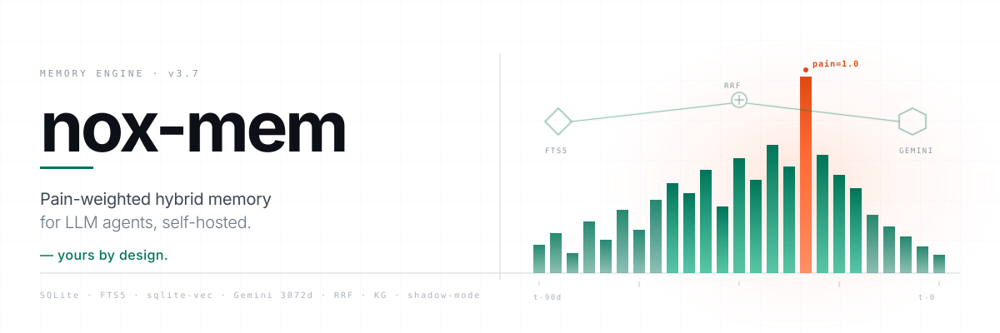
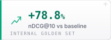
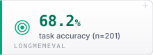
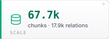
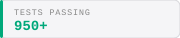
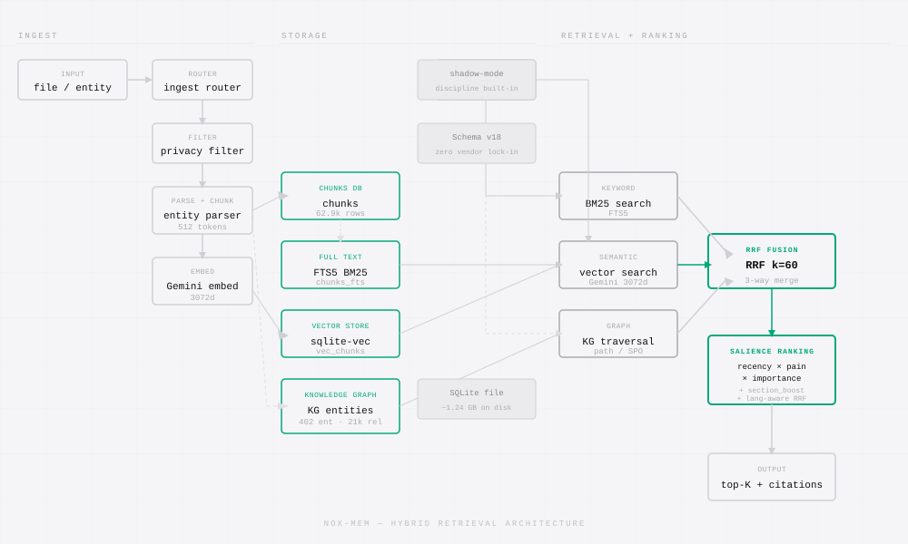
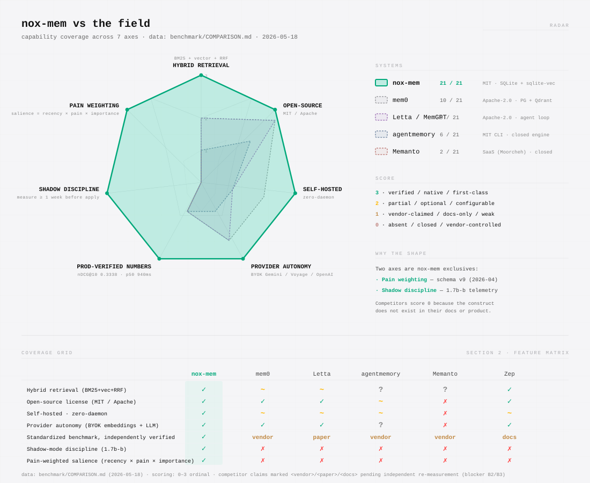

<p align="center">
  <picture>
    <source media="(prefers-color-scheme: dark)" srcset="assets/readme/banner-dark.svg">
    
  </picture>
</p>

<h1 align="center">Pain-weighted hybrid memory for LLM agents &mdash; self-hosted, yours by design.</h1>

<p align="center"><em>The only agent memory that&rsquo;s genuinely yours. SQLite on your disk, provider your choice, zero vendor lock-in.</em></p>

<p align="center">
  
  
  
</p>

<p align="center">
  <a href="LICENSE"></a>
  <a href="https://github.com/totobusnello/memoria-nox/stargazers"></a>
  <a href="https://github.com/totobusnello/memoria-nox/actions/workflows/lint-and-typecheck.yml"></a>
  <a href="https://www.bestpractices.dev/projects/12896"></a>
  <a href="paper/build/paper-tecnico-nox-mem.pdf"></a>
  <a href="https://doi.org/10.5281/zenodo.22649269"></a>
  
</p>

<p align="center">
  
</p>

<p align="center">
  <picture><source media="(prefers-color-scheme: dark)" srcset="assets/readme/stat-locomo-dark.svg"></picture>
  <picture><source media="(prefers-color-scheme: dark)" srcset="assets/readme/stat-longmemeval-dark.svg"></picture>
  <picture><source media="(prefers-color-scheme: dark)" srcset="assets/readme/stat-latency-dark.svg"></picture>
  <br>
  <picture><source media="(prefers-color-scheme: dark)" srcset="assets/readme/stat-scale-dark.svg"></picture>
  <picture><source media="(prefers-color-scheme: dark)" srcset="assets/readme/stat-opex-dark.svg"></picture>
  <picture><source media="(prefers-color-scheme: dark)" srcset="assets/readme/stat-tests-dark.svg"></picture>
</p>

<p align="center">
  <strong>Every number below is quoted from the paper together with its comparator and its caveat. When a row compares different backbones or different metrics, it says so.</strong>
  <br>
  <sub>Paper v1.0.x &middot; DOI <a href="https://doi.org/10.5281/zenodo.22649269">10.5281/zenodo.22649269</a> &middot; section references in the last column</sub>
</p>

### Headline results

| Benchmark | nox-mem | Comparator | Reading | Paper |
|---|---:|---|---|---|
| **EverMemBench Overall, same backbone** (GPT-4.1-mini, 5-batch, n=3,121) | **51.68%** (95% CI 49.88–53.49) | MemOS 42.55% | **+9.13 pp**, like-for-like | §5.1 |
| EverMemBench Overall, same backbone (Gemini-2.5-flash, 5-batch) | **62.22%** | MemOS 59.27% | +2.95 pp | §5.1 |
| EverMemBench Overall (Gemini-3-flash, 5-batch) | 63.28% | MemOS 42.55% (GPT-4.1-mini) | +20.73 pp, **backbones differ** &mdash; not a like-for-like delta | §5.1.10 |
| MuSiQue-Ans dev answer F1 (n=2,417, single run) | **58.62%** | IRCoT 35.80% &middot; EX(SA) 49.70% &middot; Beam Retrieval 69.20 | above the benchmark's own readers, **10.58 pp below the published SOTA** | §5.2.1 |
| HotPotQA dev distractor answer F1 (n=7,405, single run) | **73.37%** | DPR+FiD 65–72% &middot; Beam Retrieval 85.04 | above the reader range, **~12 pp below the published SOTA** | §5.2.2 |
| LoCoMo retrieval@10, strict | **74.52%** | &mdash; | a retrieval metric; Mem0's published 66.88% is answer F1 and **not comparable** | §5.3.1 |
| Cross-system nDCG@10, same corpus and same embedder (n=2,482) | **0.5013** | EverOS 0.6455 &middot; Zep 0.4546 &middot; Mem0 0.4337 | **second of four**; EverOS leads (it requires a cross-encoder reranker; nox-mem's run had none) | §6.3.2–§6.3.4 |

### Operational profile (self-hosted)

| Dimension | nox-mem | Note | Paper |
|---|---:|---|---|
| KG path latency p50 | **2.9 ms** | SQL + regex over `kg_relations`, no LLM call; re-validated 2026-06-15, n=10 | §5.7.1 |
| KG path cost per query | **$0.00** | local SQL only | §5.7.2 |
| Hybrid path cost per query | $0.0000015 | Gemini embedding list price. The "~667× cheaper than Mem0 Cloud" ratio rests on an *estimated* Mem0 rate | §5.7.2 |
| API process memory | **399 MB RSS**, single process | one SQLite file; no separate database, vector store or queue service | §5.7.3 |

<sub>**Methodology.** EverMemBench rows are 5-batch with a 95% CI (t-distribution); single-batch runs overstated gains and were retired as a gate. MuSiQue and HotPotQA are single full-dev-set runs. Backbones matter: only the same-backbone rows are like-for-like. MemOS: arXiv:2602.01313, Table 4. MuSiQue: Trivedi et al. 2022. HotPotQA: Yang et al. 2018. An opt-in ReAct loop (`NOX_ITERB_GEMINI=1`) lifts EverMemBench F_MH from 6.02% to 8.03% at a −3.53 pp cost on the MA composite (§5.4).</sub>

<p align="center">
  <a href="#quick-start">Quick start</a> &middot;
  <a href="#architecture">Architecture</a> &middot;
  <a href="#pillars">Pillars</a> &middot;
  <a href="#numbers">Numbers</a> &middot;
  <a href="#comparison">Comparison</a> &middot;
  <a href="#paper-and-citation">Paper</a> &middot;
  <a href="#documentation">Docs</a>
</p>

---

## Quick start

> **Where the code lives.** This repository is the research lab (paper, eval harnesses, specs). The engine itself is developed in [`totobusnello/nox-mem`](https://github.com/totobusnello/nox-mem) and published to npm as [`nox-mem`](https://www.npmjs.com/package/nox-mem). You do **not** need to clone this repo to use it.

```bash
# 1. Install (Node 20+; the SQLite driver compiles on first install if no prebuilt binary matches)
npm install -g nox-mem

# 2. Optional: embedding key for semantic search. Without it, search is keyword (FTS5)
#    and still answers natural-language questions.
export GEMINI_API_KEY=AIza...        # https://aistudio.google.com/apikey

# 3. Ingest markdown files (not directories). The store lives in ~/.nox-mem/nox.db
#    (override with NOX_DB_PATH).
nox-mem ingest ~/notes/decisions.md
nox-mem ingest ~/notes/*.md

# 4. Embed (needs the key), then search — hybrid, or keyword-only without a key
nox-mem vectorize
nox-mem search "what did we decide about deploys?" --limit 5

# 5. Time-travel and recency window (hard SQL pre-filters, not ranking boosts)
nox-mem search "deploy" --as-of 2026-04-01
nox-mem search "deploy" --changed-since 7d

# 6. Grounded answer with citations (needs the key)
nox-mem answer "what did we decide about deploys?"

# 7. Health check
nox-mem doctor
```

`nox-mem --help` lists all subcommands (knowledge graph, decisions, cross-agent search, reflect, crystallize, ...). In `doctor`, anything under *Optional integrations* marked ⚪ (Ollama, Notion, file watcher) is simply not set up — fine to skip.

**MCP server** (Claude Code, Cursor, Cline, ...) — 21 tools (`nox_mem_search` and `nox_mem_answer` with `as_of` / `changed_since`, `nox_mem_ingest`, `nox_mem_kg_query`, `nox_mem_reflect`, ...):

```bash
claude mcp add nox-mem -e GEMINI_API_KEY="$GEMINI_API_KEY" -- nox-mem-mcp
```

**HTTP API** — `NOX_API_PORT=18802 nox-mem-api`, then `curl localhost:18802/api/health` and `curl 'localhost:18802/api/search?q=deploy&limit=3'`.

Full walkthrough: [`docs/QUICKSTART.md`](docs/QUICKSTART.md).

## 3 primitives, 1 file, any LLM

The entire user-facing contract surface fits on a card. Three primitives, surfaced identically across CLI, HTTP API, and MCP, all backed by one SQLite file on your disk &mdash; and the LLM provider is swappable without code changes.

> **Status in the published package (`nox-mem@3.5.0`):** all three primitives ship on all three surfaces (CLI, HTTP, MCP), and the temporal filter applies to both `search` and `answer`.

| Primitive | Status | What it does | Surfaces | Spec |
|---|---|---|---|---|
| **`search`** | ✅ shipped | Hybrid retrieval &mdash; FTS5 BM25 &#8741; Gemini 3072d semantic &rarr; RRF fusion (k=60), Hard Mutex section gating, SOURCE_TYPE_BOOST overlays. Returns ranked chunks with scores + provenance. | `nox-mem search` &middot; `POST /api/search` &middot; `nox_mem_search` | [Paper &sect;4](paper/paper-tecnico-nox-mem.md), [`archive/specs/2026-03-14-nox-memory-system-design.md`](archive/specs/2026-03-14-nox-memory-system-design.md) |
| **`answer`** | ✅ shipped | Grounded RAG with citations &mdash; wraps `search` (top-K=10) &rarr; LLM (Gemini Flash Lite by default, D41-locked) &rarr; parses inline `[chunk_<id>]` citations &rarr; anti-hallucination retry. Empty-retrieval short-circuit avoids LLM spend. **p95 = 101.74ms** on offline bench (42&times; under 4.3s budget). | `nox-mem answer` &middot; `POST /api/answer` | [`staged/P1/README.md`](staged/P1/edits/README.md), PRs #3 #18 #31 #34 #40 #114 #283 |
| **Temporal filter** | ✅ shipped | `--as-of <date>` (time-travel) and `--changed-since <date>` (recency window) as **hard SQL pre-filters**, not ranking boosts. Closes Gap #2 (temporal decay) of the Six Gaps reframe &mdash; time is a first-class selector, not an opaque multiplier. ISO 8601 or relative (`7d`, `1w`, `30d`, `2h`, `15m`). | `--as-of` / `--changed-since` on `search` &middot; `?as_of=`, `?changed_since=` on HTTP &middot; `as_of` / `changed_since` on MCP | [`staged/P3/DEPLOY.md`](staged/P3/DEPLOY.md), PRs #2 #167 |

```bash
# search and answer both take the temporal filter (nox-mem@3.5.0)
nox-mem search "schema migration" --as-of 2026-05-01 --changed-since 30d
```

Full reference: [`docs/PRIMITIVES.md`](docs/PRIMITIVES.md).

## Why memoria-nox

Most agent memory systems force a trade you should not have to make: send your data to a vendor cloud, or self-host a half-baked store that does not retrieve well. memoria-nox refuses the trade. The whole system lives in a single SQLite file on your disk, with FTS5 keyword search, sqlite-vec 3072-dimensional Gemini embeddings, and a typed knowledge graph layered on top via Reciprocal Rank Fusion. Copy the file, you copy the memory. Switch the embedding provider, the store does not care.

The moat is not just portability. It is **shadow discipline**: every ranking change ships in shadow mode for at least seven days, with salience scores exposed on `/api/health` for offline comparison, before it is ever allowed to influence a real query. The pain field on each chunk (`severity 0.1 trivial → 1.0 prod-outage`) ensures that incidents stay retrievable when their lessons matter, not when their dates are fresh. The retrieval logic is small enough to read in one sitting, and every score in the eval harness is auditable from the SQL up.

memoria-nox is a research lab and a working product. The paper *nox-mem: Pain-Weighted Hybrid Memory for LLM Agents* ([10.5281/zenodo.22649269](https://doi.org/10.5281/zenodo.22649269), preprint, not peer reviewed) documents the formulae and the experiments that killed our own bad ideas. The repo ships the harnesses that produced those numbers, plus the same retrieval stack running against a live corpus of **94.9k chunks** and **~15.6k entities / ~21.5k relations** with a monthly OPEX under **$11**.

## Architecture

<p align="center">
  <picture>
    <source media="(prefers-color-scheme: dark)" srcset="assets/readme/architecture-dark.svg">
    
  </picture>
</p>

Five layers, one SQLite file:

1. **Ingest** &mdash; router auto-detects entity files (`compiled` / `frontmatter` / `timeline` sections with `section_boost`), markdown, or graphify input. Privacy filter applies thirteen redaction patterns pre-storage (A1, `<private>` tag, 1.7% false-positive rate, 68 tests).
2. **Store** &mdash; chunks land in SQLite with FTS5 index plus 3072-d Gemini vector via sqlite-vec. Retention is typed: `feedback` and `person` never decay, `lesson` 180d, `decision` and `project` 365d, default 90d. Schema v19 is additive and idempotent.
3. **Retrieve** &mdash; query runs in parallel through FTS5 BM25 and Gemini semantic. RRF fusion (k=60) merges. Language-aware weights (D, Wave 1 E14) tilt dense up on PT queries (1.15) and FTS down (0.85), balanced on EN/mixed.
4. **Rank** &mdash; salience (`recency × pain × importance`) composes additively with section_boost (`compiled 2.0 / frontmatter 1.5 / timeline 0.8`) and temporal boost (E13). Shadow mode is the default; flipping to active requires `NOX_SALIENCE_MODE=active` and seven days of baseline.
5. **Answer** &mdash; CLI, MCP, and HTTP surfaces with citation footers, anti-hallucination guard, telemetry persistence, and a phase-broken-down latency budget.

Mermaid source: [`assets/readme/mermaid/architecture-source.mmd`](assets/readme/mermaid/architecture-source.mmd). Deeper architecture write-up: [`docs/ARCHITECTURE.md`](docs/ARCHITECTURE.md). Paper: [`paper/paper-tecnico-nox-mem.md`](paper/paper-tecnico-nox-mem.md).

## Pillars

memoria-nox is organized into three product pillars plus a research lab and a now-unlocked GTM phase. Full breakdown with sprint-level DoDs lives in [`docs/ROADMAP.md`](docs/ROADMAP.md).

<table align="center">
<tr>
<td align="center" width="33%">
<h3>Q &mdash; Quality</h3>
<sub>Every number with its comparator</sub><br><br>
<strong>EverMemBench +9.13 pp over MemOS, same backbone</strong><br>
<sub>MuSiQue 58.62% · HotPotQA 73.37% answer F1, above the benchmarks' readers, below published SOTA</sub><br><br>
5-batch 95% CI · cross-bench
</td>
<td align="center" width="33%">
<h3>A &mdash; Autonomy</h3>
<sub>Data yours, provider your choice</sub><br><br>
<strong>Zero vendor lock-in</strong><br>
<sub>SQLite file, A1 privacy filter, A2 AES-256-GCM export</sub><br><br>
A1 · A2 · A3 · A4
</td>
<td align="center" width="33%">
<h3>P &mdash; Product</h3>
<sub>Self-hosted operational profile</sub><br><br>
<strong>KG path 2.9 ms p50 · $0/query · 399 MB RSS</strong><br>
<sub>$0 marginal cost on the KG path · one process, one SQLite file</sub><br><br>
P1 · P3 · P5 · P5a
</td>
</tr>
</table>

### Q &mdash; Quality (Q1&ndash;Q4)

Each number carries its comparator and its caveat. The headline table at the top of this page is the short version; this is the longer one.

**EverMemBench (5-batch, 95% CI, n≈3,120 per backbone):**
- **Same backbone, GPT-4.1-mini: 51.68% vs MemOS 42.55% = +9.13 pp** (lower CI bound 49.88%). This is the like-for-like result.
- Same backbone, Gemini-2.5-flash: 62.22% vs MemOS 59.27% = +2.95 pp.
- Gemini-3-flash backbone: Overall 63.28% and MA composite 88.42%, against MemOS's published GPT-4.1-mini numbers (42.55% / 55.68%). **The backbones differ**, so the +20.73 pp / +32.74 pp deltas mix a backbone upgrade with the memory system (§5.1.10). Opt-in via `NOX_ANSWER_BACKBONE=gemini-3-flash-preview` (D70).

**Classical multi-hop QA, no task-specific training (single full-dev-set runs):**
- **MuSiQue-Ans answer F1 58.62%** (n=2,417 dev, PR #407): above the benchmark's own readers (IRCoT 35.80%, EX(SA) 49.70%) and **10.58 pp below Beam Retrieval (69.20)**, the published state of the art. Per-hop: 2hop 59.42% / 3hop1 64.27% / 4hop3 47.84%.
- **HotPotQA answer F1 73.37%** (n=7,405 dev distractor, PR #408): above the DPR+FiD reader range (65–72%) and **~12 pp below Beam Retrieval (85.04) and FE2H (84.44)**. Per-type: bridge 71.42% / comparison 81.12%.
- The backbones of these comparators differ from ours; the deltas are positioning, not SOTA claims (§5.2).

**LoCoMo (PR #396, #404):**
- **Retrieval@10 strict 74.52%**, multi-hop retrieval@10 82.21% strict / 92.91% adj-2. Mem0's published 66.88% is end-to-end **answer F1** &mdash; a different metric, not a head-to-head (§5.3.1).
- Our own answer-F1 push: 51.85% (rank-5), above Zep 50.40% / LangMem 50.21%.

**EverMemBench F_MH.** The 3–7% F_MH scores on EverMemBench are a corpus-structural difficulty (very long conversation chains, strict scoring), not a multi-hop reasoning failure: the same pipeline composes multi-hop answers competently on MuSiQue and HotPotQA (§5.4). An opt-in ReAct loop (PR #419, `NOX_ITERB_GEMINI=1`) lifts F_MH from 6.02% to 8.03% on Gemini-3-flash, at a −3.53 pp cost on the MA composite.

**LongMemEval (PR #378):** task accuracy 68.16% (n=201 judged, Wilson 95% CI 0.614–0.742).

**Lab Q1 standalone knobs (Wave A):** KG path retrieval $0/query (PR #379), MQ canonical multi-hop (PR #385), MAP rerank protection (PR #386), adaptive classifier (PR #381). Q3 IterC Self-Ask opt-in for F_HL synthesis (PR #406).

**Methodology:** 5-batch + 95% CI (t-distribution, ~620 questions per batch) is the gate for EverMemBench; single-batch runs overstated gains by up to 1.7σ and were retired. MemOS: arXiv:2602.01313, Table 4. MuSiQue: Trivedi et al. 2022. HotPotQA: Yang et al. 2018.

### A &mdash; Autonomy (A1&ndash;A4)

The "yours by design" claim, made tangible and auditable. A1 (privacy filter pre-storage, 13 patterns, integrated in the ingest router) is implemented. A2 (schema export/import portable, AES-256-GCM with scrypt, AAD-stable manifest, `--passphrase` argv rejected for `ps aux` leak guard) ships round-trip preservation of `nDCG@10 ± 0.001`. A3 (provider abstraction layer with fallback chain, cost cap, telemetry, 15 refactor sites) measured **0.0025ms overhead** per LLM call. A4 (zero-vendor validation suite, 8 CI checks) proves no third-party runtime dep is critical.

### P &mdash; Product (P1&ndash;P5 + P5a)

UX that ships without compromising Q or A. P1 (`answer` primitive with CLI + HTTP + MCP surfaces, anti-hallucination guard, citation parsing, telemetry on schema v11) measured **p95 = 101.74ms** on the latency benchmark, 42&times; under the 4.3s budget. P3 (`--as-of` / `--changed-since` temporal queries as hard pre-filters, not boosts) is implemented as a staged patch set. Both ship in `nox-mem@3.4.0`: P1 on the CLI and HTTP (MCP tool pending), P3 on CLI, HTTP and MCP (see the status note under [3 primitives](#3-primitives-1-file-any-llm)). P5 (real-time SSE viewer with four panels, default-deny redaction, multi-client fan-out, Last-Event-ID resume) shipped a **11.7KB** vanilla-JS frontend &mdash; HTML+JS+CSS combined, no bundler, no React. P5a is the event-bus refactor that P5 depends on. P2 (Claude Code hooks for zero-manual-ingest auto-capture, five privacy layers) is the active sprint.

### Lab &mdash; Retrieval research (40% capacity)

Paper-grade work, no ship pressure. L2 (KG conflict and contradiction detection over opposing relations) and L3 (confidence and provenance field, schema v19, gated on eval lift) are specced. L4 (regex-first typed-link extraction with Gemini fallback, gbrain-inspired) measured **95.8% precision/recall** on a synthetic corpus and **80% Gemini calls eliminated** via a confidence gate (`wikilinks ≥0.90` skip LLM, `bare_refs 0.75` fall through). L1 (E15 CodeGraph-inspired A+B+C) is paused until Q1 closes.

**D49 phase 1 (temporal retrieval spike)** deployed 2026-05-20 in shadow mode (PR #167, `src/temporal-retrieval.ts`): ISO date detector + proximity rerank. Logs `temporal_path` events with `applied: false` during 7-day shadow baseline before D50 gate. **Q105&ndash;Q110** (six temporal eval queries at gold rank 5&ndash;13) curated 2026-05-20 (PR #168) to measure proximity rerank lift without ceiling effects.

### GTM Phase 2 &mdash; Viral launch (UNLOCKED 2026-05-18)

**Q4 gate PASSED.** Q1 canonical measurement (G5 V3 A8 on the internal golden set: nDCG@10 = 0.6237, +78.8% over G3 baseline 0.3488, measured 2026-05-19) cleared the D43 threshold (&ge;+15%). Phase 2 playbook unlocked: hero visual upgrade (this README), Trendshift badge, Product Hunt launch, paper distribution to dev.to / LinkedIn / Substack, **Stripe-first global SaaS go-to-market** (D44b pivot: USD default, no affiliate program, Brazilian market as secondary tier via PIX integration future). If production-path scale-up testing reveals regression below +15%, scale-up pauses but the initial Phase 2 claim stands. Spec: [`specs/2026-05-17-GTM-readme-hero-upgrade.md`](specs/2026-05-17-GTM-readme-hero-upgrade.md). Decisions: [`docs/DECISIONS.md`](docs/DECISIONS.md) (D43 + D44).

## Numbers

Each row names the artifact or paper section it comes from; dated rows are snapshots. Cross-system comparisons live in [Comparison](#comparison), not here.

| Metric | Value | Source |
|---|---|---|
| Chunks in the main production store | **67.7k** (complete vector coverage, Gemini 3072d) | measured 2026-09-09, paper §7 |
| KG | **~15.6k entities / ~17.9k relations** | production snapshot 2026-07-25 |
| Internal golden nDCG@10 (n=78, honest set) | **0.6813** &mdash; +9.8pp / +16.9% over paper baseline 0.5831 | [`benchmark/baseline-2026-05-18.json`](benchmark/baseline-2026-05-18.json) (`metrics.L4`) |
| Answer primitive p95 latency | **101.74ms** total (42&times; under 4.3s budget; mock LLM @ 100ms) | P1 benchmark, PR&nbsp;#40 |
| Provider abstraction overhead | **0.0025ms** absolute per LLM call (target &lt;0.5ms) | A3 benchmark, PR&nbsp;#39 |
| L4 regex-first typed-link extraction | **95.8% precision/recall**, **80% Gemini calls eliminated** | synthetic corpus n=20, PR&nbsp;#38 |
| P5 viewer frontend bundle | **11.7KB** total (HTML+JS+CSS, vanilla, no bundler) | PR&nbsp;#42 |
| Wave B tests passing | **535+** across L4, A3, P1, A2, P5 | Wave B post-mortem |
| Schema migrations | **v11 (telemetry) + v19 (confidence/provenance)** &mdash; additive, idempotent | PR&nbsp;#28 |
| Monthly OPEX (Gemini embed + KG + VPS) | **&lt;$11/mo** all-in, Mar&ndash;May 2026 | operator's invoices (not published) |
| Internal golden set nDCG@10 (G5 V3 A8, n=100) | **0.6237** (+78.8% over the pre-Wave-A baseline 0.3488) | paper §5, measured 2026-05-19 |
| LoCoMo production path (n=100, May 2026) | nDCG@10 **0.5961** &middot; R@10 **0.7070** &middot; MRR **0.5534** | [`paper/publication/results/locomo-production-path-results.json`](paper/publication/results/locomo-production-path-results.json); for cross-system numbers see [Comparison](#comparison) |
| Latency `/api/search` hybrid (n=95) | **p50 = 940ms / p95 = 2342ms / p99 = 2523ms** | [paper/publication/results/latency-benchmark-summary.json](paper/publication/results/latency-benchmark-summary.json), verified 2026-05-18 |
| Concurrent load `/api/answer` (5 threads, n=15) | **100% 200 OK, p95 = 5143ms, zero errors** | [paper/publication/results/answer-concurrent-smoke.json](paper/publication/results/answer-concurrent-smoke.json), verified 2026-05-18 |
| LongMemEval oracle (pipeline validated, n=100) | **1.0 saturated** (oracle has ~0 distractors &mdash; expected). `s_cleaned` headline run deferred (~$2.40, requires batch optimization). | [paper/publication/results/longmemeval-hybrid-summary.md](paper/publication/results/longmemeval-hybrid-summary.md) |

Wave B post-mortem with PR-by-PR breakdown: [`docs/post-mortems/WAVE-B-2026-05-18.md`](docs/post-mortems/WAVE-B-2026-05-18.md).

## Comparison

### EverMemBench + LongMemEval — 5-batch validated (2026-05-28/29)

*Full methodology, per-category breakdown, and 95% CI intervals: [`docs/COMPARISON.md`](docs/COMPARISON.md) · [`docs/COMPETITIVE-POSITIONING.md`](docs/COMPETITIVE-POSITIONING.md). Q4 cross-system canonical run executed 2026-06-15 (§6, below).*

| System | EverMemBench Gemini<br>(5-batch, n=3,119) | EverMemBench GPT-4.1-mini<br>(5-batch, n=3,121) | LongMemEval<br>task acc (n=201 judged) | Backbone<br>swap Δ |
|---|---|---|---|---|
| **nox-mem (hybrid)** | **62.22%** | **51.68%** | **68.16%** | **−10.54pp** |
| MemOS | 59.27% | 42.55% | — | −16.72pp |
| **nox-mem advantage** | **+2.95pp** | **+9.13pp** | — | smaller drop on backbone swap |
| mem0 | pending | pending | — | — |
| Zep | pending | pending | — | — |
| Letta (MemGPT) | pending | pending | — | — |

> **Reading the numbers honestly:** Both EverMemBench wins are **5-batch validated** with 95% CI (n=3,100+ questions per system per backbone). The Gemini +2.95pp win is tighter; the GPT-4.1-mini +9.13pp win is larger and robust (lower CI bound 49.88% still above MemOS 42.55%). A single-batch run (Phase H v2 batch 004) showed +11.60pp — the 5-batch protocol caught the outlier and corrected to the honest +9.13pp. **Methodology disclosure:** [`docs/discussions-seed/06-methodology-disclosure.md`](docs/discussions-seed/06-methodology-disclosure.md). MemOS numbers from MemOS paper Table 4 (public). F_MH (multi-hop) gap −13 to −16pp vs MemOS is backbone-invariant — a retrieval problem, not generation. KG path retrieval (opt-in) closes 17% of this gap at $0/query. Q4 cross-system canonical run executed 2026-06-15 — see below.

### Q4 cross-system head-to-head — canonical run (2026-06-15, n=100/dataset, same-namespace fair)

*Retrieval quality (nDCG@10) on a shared corpus + harness, each system on its native default embedding. In this run 3 systems produced numbers; Zep and EverOS were measured later on the full set (below), Letta remains a gap. Detail: [`paper §6`](paper/paper-tecnico-nox-mem.md) · [`docs/COMPARISON.md`](docs/COMPARISON.md).*

| System | LongMemEval nDCG@10 | LoCoMo nDCG@10 | Cost/query |
|---|---:|---:|---:|
| **nox-mem (hybrid)** | **0.5234** | 0.4263 | **$0 (local)** |
| mem0 | 0.4764 | **0.4686** | subscription + OpenAI embed |
| agentmemory | 0.2803 | 0.1587 | $0 (local) |

> **Split, reported honestly:** nox-mem wins LongMemEval (+0.047), mem0 wins LoCoMo (+0.042); agentmemory distant third. Both datasets shown &mdash; no cherry-pick. nox-mem is competitive with the market leader on retrieval *while* running as a single SQLite file at $0/query.
>
> **Systems that did not run on 2026-06-15.** Zep needed a privileged Docker host and EverOS needed third-party credentials the run did not have; both were measured on 2026-09-10 over the full set (next section). Letta routes retrieval through an LLM agent turn at ~16 min/query and remains a documented gap (paper §6.3.1).

### Q4 controlled-embedding variant (rc4, 2026-06-29 — both systems on Gemini 3072d, full n=2,482)

*The split above is under each system's **native** embedder (nox Gemini 3072d, mem0 OpenAI 1536d). The most obvious confound on that split is the embedding provider itself. Equalizing it — both on `gemini-embedding-001` @ 3072d, over the full evaluation set (1,982 LoCoMo + 500 LongMemEval) — **inverts the split**. Detail: [`paper §6.3.2`](paper/paper-tecnico-nox-mem.md) · [`docs/COMPARISON.md`](docs/COMPARISON.md).*

| System (all-Gemini 3072d, n=2,482) | LongMemEval nDCG@10 | LoCoMo nDCG@10 | Overall |
|---|---:|---:|---:|
| **nox-mem (hybrid)** | **0.5255** | **0.4952** | **0.5013** |
| mem0 (Gemini embedder, Chroma) | 0.4061 | 0.4407 | 0.4337 |

> **With the embedder matched, nox-mem outperforms mem0 on both datasets** (LongMemEval +0.119, LoCoMo +0.055; 95% CIs disjoint) **and all 5 represented query categories** — the mem0 LoCoMo win in the as-configured run was substantially an OpenAI-embedder effect, not a retrieval-architecture advantage. Three residual confounds are declared (mem0's runtime version was never recorded — the artifact stores the declared pin, not `mem0.__version__`; faiss→Chroma backend; n=100→2,482 sample scope): this is an embedding-**matched** comparison, not a pure architecture isolation.
>
> **Task-type ablation (2026-06-30) — the one asymmetry that favored nox is ruled out.** nox passes Gemini's `RETRIEVAL_*` task types; mem0 does not. Re-running nox with a **generic** embedding (no task type, exactly how mem0 calls the model) drops it only **0.5013 → 0.4979 overall (−0.34 pp)** and it **still wins overall, both datasets** (LoCoMo 0.4920 vs 0.4407; LME 0.5215 vs 0.4061) **and all 5 categories**. The win is architectural (hybrid FTS5 + dense + RRF), not an embedding-mode artifact. (Rigor caveat: the re-ingested generic corpus reached 99.03% gold coverage — a handicap that only lowers nox; the win persists.)
>
> **Both readings stand side by side, by design** — the as-configured split (above) is the honest "each system as it ships" view; the controlled variant is the "same embedder, who wins on architecture" view. We do not delete one to flatter the other.

### Full evaluation set, same corpus and same embedder (n=2,482)

*Four systems over the same corpus, the same 2,482 queries and the same binary-relevance nDCG@10 at k=10. Detail: paper §6.3.2–§6.3.4.*

| System | Overall nDCG@10 | LoCoMo (n=1,982) | LongMemEval (n=500) | p50 latency |
|---|---:|---:|---:|---:|
| EverOS 1.3.1 (2026-09-10) | **0.6455** | **0.6585** | **0.5942** | 1,592 ms |
| **nox-mem** (rc4, 2026-06-29) | 0.5013 | 0.4952 | 0.5255 | 653 ms |
| Zep 0.27.2 (2026-09-10) | 0.4546 | 0.4793 | 0.3567 | 6,002 ms |
| Mem0 (rc4, 2026-06-29) | 0.4337 | 0.4407 | 0.4061 | not captured |

> **EverOS outperforms nox-mem on both datasets** (+0.144 overall). The pipelines differ: EverOS *requires* a cross-encoder reranker (`Qwen3-Reranker-4B`) and refuses to search without one; nox-mem's run had no reranking stage. We report the result that goes against us in the same table as the ones that do not. nox-mem places second of four, ahead of Zep and Mem0.

The full head-to-head matrix against agentmemory, memanto, mem0, Letta, and Zep lives in [`docs/COMPARISON.md`](docs/COMPARISON.md). The seven-axis differentiation:

<p align="center">
  <picture>
    <source media="(prefers-color-scheme: dark)" srcset="assets/readme/comparison-chart-dark.svg">
    
  </picture>
</p>

**Pain weighting** (an operator-assigned severity persisted on each chunk) and **shadow discipline** (ranking changes must pass a shadow phase before activation) are the paper's primary contributions. The scoring shape itself follows Generative Agents (recency, importance, relevance); paper §1.5 states what is and is not new.

| Capability | mem0 | MemGPT/Letta | A-MEM | LangChain Memory | **nox-mem** |
|---|---|---|---|---|---|
| Local-first single-file SQLite | &times; | &times; | &times; | partial | &check; |
| BYO embedding provider | partial | &times; | &check; | &check; | &check; |
| Typed knowledge graph with edge reasons | partial | &times; | &check; | &times; | &check; |
| Shadow-mode ranking discipline | &times; | &times; | &times; | &times; | &check; |
| Pain-weighted salience | &times; | &times; | &times; | &times; | &check; |
| Published reproducible paper + harness | &times; | &check; | &check; | &times; | &check; (v1.0.0) |
| MIT, no usage caps, no telemetry phone-home | partial | &check; | &check; | &check; | &check; |

## Works with every agent

**Tier A &mdash; first-class integration:** Claude Code (MCP), ChatGPT (HTTP), Cursor (MCP), Cline (MCP), OpenClaw (native plugin).

**Tier B &mdash; works via MCP or HTTP:** Continue, Aider, Codex, Roo, Tabnine, Windsurf, Goose, Zed, Open Interpreter, LangChain, LlamaIndex, CrewAI, AutoGen, custom.

Per-agent setup: [`integrations/`](integrations/) · MCP/HTTP wiring: [`docs/QUICKSTART.md` §3](docs/QUICKSTART.md#3-connect-an-agent). The MCP server exposes 21 tools. The HTTP API exposes `/api/{health,search,kg,kg/path,agents,cross-kg,reflect,procedures,crystallize,brief}` plus `POST /api/answer`.

## Paper and citation

**Title:** *nox-mem: Pain-Weighted Hybrid Memory for LLM Agents*

**DOI:** [`10.5281/zenodo.22649269`](https://doi.org/10.5281/zenodo.22649269) &middot; concept DOI (always latest): [`10.5281/zenodo.22649268`](https://doi.org/10.5281/zenodo.22649268)

**Status:** preprint on Zenodo, 2026-09-07, CC BY 4.0. **Not peer reviewed.**

⚠️ **It is not on arXiv, and that is settled, not pending.** arXiv did **not accept** the
manuscript on 2026-09-03, stating it *"would benefit from additional review and revision
that is outside of the services we provide"*. arXiv does not assess scientific
correctness, so that sentence means "needs peer review, which we do not perform" — it is
not a finding against any specific claim. A repository DOI does **not** satisfy that
condition. Earlier versions of this README said "submission pending"; that had been false
since 2026-09-03.

**PDF:** [`paper/build/paper-tecnico-nox-mem.pdf`](paper/build/paper-tecnico-nox-mem.pdf) &middot; changelog: [`paper/CHANGELOG.md`](paper/CHANGELOG.md)

```bibtex
@article{busnello2026noxmempaper,
  title     = {nox-mem: Pain-Weighted Hybrid Memory for LLM Agents},
  author    = {Busnello, Luiz Antonio},
  year      = {2026},
  month     = {9},
  publisher = {Zenodo},
  doi       = {10.5281/zenodo.22649269},
  url       = {https://doi.org/10.5281/zenodo.22649269},
  note      = {Preprint, not peer reviewed}
}
```

## Citation

If you use nox-mem in your research or production:

```bibtex
@software{busnello2026noxmem,
  title   = {nox-mem: Pain-Weighted Hybrid Memory for LLM Agents},
  author  = {Busnello, Luiz Antonio},
  year    = {2026},
  month   = {6},
  url     = {https://github.com/totobusnello/memoria-nox},
  version = {1.0.0},
  doi     = {10.5281/zenodo.22649269},
  note    = {Paper DOI; the software itself is MIT on GitHub}
}
```

See [`CITATION.cff`](CITATION.cff) for the canonical citation file format.

## Repository layout

The repo is a research lab and a working product; the tree reflects both.

| Path | What's in it |
|---|---|
| [`paper/`](paper/) | The paper (`paper-tecnico-nox-mem.md`), built PDF (`build/`), `refs.bib`, `CHANGELOG.md` |
| [`eval/`](eval/) | Evaluation harnesses — EverMemBench, LongMemEval, LoCoMo, the Q4 cross-system comparison (`q4-comparison/`) |
| [`benchmark/`](benchmark/) | Cross-system comparison harness + `latency-cost/` operational measurements |
| [`staged/`](staged/) | Implementation patch sets cited by the paper as *"Implementation:"* pointers — see [`staged/README.md`](staged/README.md) |
| [`clients/`](clients/) · [`sdk/`](sdk/) · [`integrations/`](integrations/) · [`examples/`](examples/) | Language clients, SDK, IDE/agent integrations, runnable examples (default `localhost:18802`) |
| [`docs/`](docs/) · [`docs-site/`](docs-site/) | Architecture, decisions, handoff, incidents (the "pain diary"), runbooks; published docs site |
| [`specs/`](specs/) · [`audits/`](audits/) · [`plans/`](plans/) | Pre-registered specs, post-change audits, planning history (open-research transparency) |
| [`tests/`](tests/) · [`validation/`](validation/) | Test suites and deploy/validation reports |
| `archive/` · `handoffs/` · `experiments/` · `lessons/` · `runbooks/` | Working/research artifacts kept for traceability |

## Documentation

| Topic | File |
|---|---|
| Long-term strategic vision | [`docs/VISION.md`](docs/VISION.md) (v15) |
| Roadmap with Q/A/P pillars, capacity, and gates | [`docs/ROADMAP.md`](docs/ROADMAP.md) |
| Append-only decisions log (why we do not do reranker, focus_boost, A1/A2/G) | [`docs/DECISIONS.md`](docs/DECISIONS.md) |
| Current state and next action | [`docs/HANDOFF.md`](docs/HANDOFF.md) |
| Deeper architecture and module map | [`docs/ARCHITECTURE.md`](docs/ARCHITECTURE.md) |
| Incident log (the pain diary that feeds salience) | [`docs/INCIDENTS.md`](docs/INCIDENTS.md) |
| Operational rules and critical constraints | [`CLAUDE.md`](CLAUDE.md) |
| Deploy guide for Wave B staged patches | [`docs/DEPLOY-WAVE-B.md`](docs/DEPLOY-WAVE-B.md) (when merged) |
| Paper &mdash; *nox-mem: Pain-Weighted Hybrid Memory for LLM Agents* | [`paper/`](paper/) &middot; [`paper/CHANGELOG.md`](paper/CHANGELOG.md) |
| Wave B post-mortem (2026-05-18) | [`docs/post-mortems/WAVE-B-2026-05-18.md`](docs/post-mortems/WAVE-B-2026-05-18.md) |
| VPS health monitoring (IP swap + API outage detector) | [`scripts/vps-healthcheck.sh`](scripts/vps-healthcheck.sh) |
| Observability dashboard (F10 Phase A + B, deployed 2026-05-21) | [`specs/2026-05-01-F10-observability-dashboard.md`](specs/2026-05-01-F10-observability-dashboard.md) &mdash; live `/observability/{health,evals}.html` on the API server |

The retrieval logic is intentionally small. Start at [`nox-mem/src/search.ts`](https://github.com/totobusnello/nox-mem/blob/main/nox-mem/src/search.ts) in the engine repo and read until you are bored &mdash; it should not take long.

### Configuration

Top environment variables. Full reference: [`docs/CONFIGURATION.md`](docs/CONFIGURATION.md).

| Variable | Default | Purpose |
|---|---|---|
| `NOX_API_PORT` | `18802` | HTTP API port. Never hardcode &mdash; Chrome squats on 18800. |
| `NOX_SALIENCE_MODE` | `shadow` | Salience ranking mode: `shadow` (default) or `active`. Active requires 7d baseline. |
| `NOX_EMBED_PROVIDER` | `gemini` | Embedding provider: `gemini`, `openai`, or `local`. |
| `GEMINI_API_KEY` | _optional_ | Default embedding provider key. BYO &mdash; never proxied. Without any embedding key, search is keyword-only (FTS5) and `answer` / `vectorize` are unavailable. |
| `NOX_FTS_OR_FALLBACK` | `auto` | When a keyword (AND) query finds nothing, retry with OR of the content terms. `auto` = only when no embedding key is set; `on` / `off` force it. |
| `NOX_DB_PATH` | `~/.nox-mem/nox.db` | SQLite store location (an existing `<package>/nox-mem.db` from ≤3.3 keeps being used). `cp` is your backup. |
| `NOX_LANG_AWARE_RRF` | `1` | Language-aware RRF fusion weights (D, +1.92pp on PT/EN mix). |
| `NOX_SEARCH_LOG_TEXT` | `0` | Persist query text in `search_telemetry` for eval harness. |
| `NOX_L4_REGEX_ENABLED` | `0` | Enable regex-first typed-link extraction (Lab sprint L4). |
| `NOX_KG_EXTRACT_MODE` | `hybrid_shadow` | KG extraction mode: `regex_only`, `gemini_only`, `hybrid_shadow` (default), `hybrid_active`. Watch L4 first-fire on Sunday cron. |
| `NOX_MUTEX_QUERY_ENTITY_THRESHOLD` | `2` | G10d Conditional Hard Mutex threshold (D51). Mutex applied when `query_entities ≤ N`; bypass on multi-entity queries to preserve chain signal. |
| `NOX_DISABLE_CONDITIONAL_MUTEX` | `0` | Rollback to G10 always-on Hard Mutex (skip the conditional layer). |
| `NOX_ITERB_GEMINI` | `0` | Q3 IterB ReAct multi-round orchestration on Gemini-3-flash backbone (PR #419). +2.01pp clean F_MH lift on best backbone (breaks Wave A/B/C single-stage ceiling 7.25% by +0.78pp); MA composite -3.53pp trade-off. Opt-in for offline/analytics workloads where F_MH ceiling break matters more than MA composite. Cost $0.00295/q. |
| `NOX_ALLOW_NO_SNAPSHOT` | `0` | Emergency override for destructive ops without pre-op snapshot. |

## Contributing

memoria-nox is research-grade infrastructure with production discipline. Contributions are welcome on three axes:

1. **Reproductions.** Run the eval harnesses in [`benchmark/`](benchmark/) on your hardware and open an issue with the JSON output. Disagreements with our numbers are worth more than agreements.
2. **Ranking changes.** Any PR that touches `src/lib/search.ts`, `src/lib/salience.ts`, or RRF weights must include a shadow-mode plan (&ge;7d baseline on `/api/health.salience`) and an eval delta against the golden set. The discipline is not optional.
3. **New providers, new IDE integrations, new retrieval features.** Spec first, code second. See [`docs/CONTRIBUTING.md`](docs/CONTRIBUTING.md) and any open issue tagged `good-first-feature`.

Operational guardrails (destructive ops require `--dry-run` or `withOpAudit()` snapshot; `sed` is banned on `.db` files; `NOX_ALLOW_NO_SNAPSHOT=1` only for legitimate disk-full emergencies) live in [`CLAUDE.md`](CLAUDE.md). Read them before sending a fix that touches ingest, reindex, or compact.

## License

MIT. See [`LICENSE`](LICENSE). Your data, your disk, your provider, your rules.

## Acknowledgments

memoria-nox stands on shoulders. The **Six Gaps** framing for agent memory was sharpened by reading the memanto research notes &mdash; their backend stays closed, but the gap taxonomy was a gift. The **regex-first typed-link extraction** in Lab sprint L4 is a clean lift of the pattern shipped by gbrain, adapted to our confidence-gate model. The **shadow-mode discipline** is our own scar tissue from incident v3.4 (multiplicative boost stacking), documented in [`docs/INCIDENTS.md`](docs/INCIDENTS.md) so the next person does not have to learn it the way we did. And to **Garry Tan and the YC orbit** &mdash; the halo of "ship reproducible work or don't ship" is the only reason this repo has a paper and a harness instead of a screenshot.

If you copy an idea from here, attribute it. If you find a number that does not hold up, open an issue.

---

<p align="center">
  <picture>
    <source media="(prefers-color-scheme: dark)" srcset="assets/readme/logo-dark.svg">
    
  </picture>
</p>

<p align="center">
  <strong>Pain-weighted hybrid memory with shadow discipline &mdash; yours by design.</strong>
  <br>
  <sub>MIT License &middot; Maintained by <a href="https://github.com/totobusnello">@totobusnello</a> &middot; <a href="https://github.com/totobusnello/memoria-nox/graphs/contributors">Contributors</a></sub>
</p>
